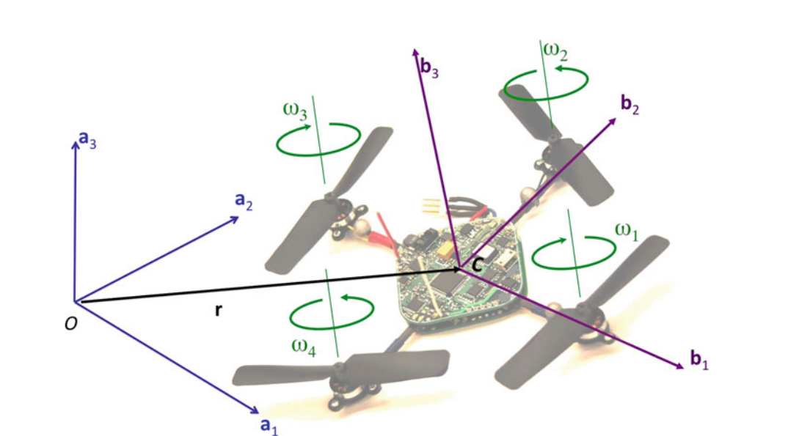
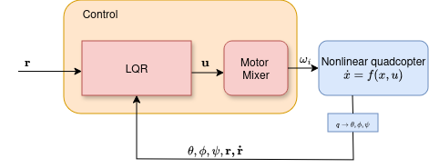

# Predlog projekta - QUADCOPTER (DRONE) CONTROL

### 1. Kratak opis projekta
Upravljanje pozicijom drona (letelica sa 4 rotora - kvadkopter) koristeći LQ regulator.

### 2. Model sistema

<figure id="myfigure" class="numbered">
Slika 1: Referance frames
</figure>

Translaciona i rotaciona dinamika kavdkoptera[1][2] je data sa
$$
\dot{x} = 
\begin{bmatrix}
\dot{r} \\ 
\ddot{r} \\
\dot{q}\\
\dot{\omega}
\end{bmatrix}
= f(x, u) =
\begin{bmatrix}
\bf{v} \\
\bf{G} + R u_1 \\
\frac{1}{2}\Omega(w)q\\
I^{-1} (\tau - \omega \times I\omega)
\end{bmatrix},
$$
gde su $ \dot{r} $, $ \ddot{r} $, $ \dot{q} $, $ \dot{\omega}  $ brzina, ubrzanje, izvod kvaterniona i ugaono ubrzanje, respektivno. 

Definicija ostalih izraza u modelu:
$$
r = \begin{bmatrix}
x \\ y \\ z
\end{bmatrix}
,
\dot{r} = \begin{bmatrix}
\dot{x} \\ \dot{y} \\ \dot{z}
\end{bmatrix}
,
q = 
\begin{bmatrix}
q_0 \\ q_1 \\ q_2 \\ q_3
\end{bmatrix}
\omega = 
\begin{bmatrix}
0 \\ \omega_x \\ \omega_y \\ \omega_z 
\end{bmatrix},
\\ \\
$$
$$
R(q) = \begin{bmatrix}
1-2(q_2^2+q_3^2) & 2(q_1q_2-q_0q_3) & 2(q_1q_3+q_0q_2) \\
2(q_1q_2+q_0q_3) & 1-2(q_1^2+q_3^2) & 2(q_2q_3-q_0q_1) \\
2(q_1q_3-q_0q_2) & 2(q_2q_3+q_0q_1) & 1-2(q_1^2+q_2^2)
\end{bmatrix},
\\$$
$$ 
G = \begin{bmatrix}
0 \\ 0 \\ -g
\end{bmatrix}
,
\Omega(\omega) = 
\begin{bmatrix}
0 & -\omega_x & -\omega_y & -\omega_z \\
\omega_x & 0 & -\omega_z & \omega_y \\
\omega_y & \omega_z & 0 & -\omega_x \\
\omega_z & -\omega_y & \omega_x & 0 \\
\end{bmatrix},
I = \begin{bmatrix}
I_{xx} & 0 & 0 \\
0 & I_{yy} & 0 \\
0 & 0 & I_{zz}
\end{bmatrix}.
$$
Vektori upravljanja $\bf{u_1}$ i $\tau$  su dati sa
$$
\bf{u_1} = \begin{bmatrix}
0 \\ 0 \\ F_1 + F_2 + F_3 + F_4
\end{bmatrix},
\bf{\tau} = \begin{bmatrix}
0 & L & 0 & -L \\
L & 0 & -L & 0 \\
\gamma & -\gamma & \gamma & -\gamma
\end{bmatrix}
\begin{bmatrix}
F_1 \\ F_2 \\ F_3 \\ F_4
\end{bmatrix},
$$
gde su $F_i$, $ i= 1, 2, 3, 4$ sile u smeru $b_3$ ose proizvedene na motorima, dok su $L$ i $ \gamma$ dužina kraka kvadkoptera (rastojanje između centra mase i pozicije motora) i odnos $\frac{k_M}{k_F}$, respektivno. Sile koje se razvijaju na motorima su uzete kao proporcialne kvadratu brzine obrtaja motora, dakle, $F_i \propto \omega_i^2$ [2]. Naime, uzete su sledeće relacije: 
$$
F_i = k_F \omega_i^2,
M_i = k_M \omega_i^2,
$$
gde su $k_F$ i $k_M$ konstante motora (empirijski poznate), dok $M_i$ predstavlja moment inercije koji se razvija usled rotacije rotora, normalno na osu rotacije rotora. Dakle ukupan vektor upravljanja $\bf{u}$ možemo predstaviti kao 
$$
\bf{u} =
\begin{bmatrix}
1 & 1 & 1 & 1 \\
0 & L & 0 & -L \\
L & 0 & -L & 0 \\
\gamma & -\gamma & \gamma & -\gamma
\end{bmatrix}
\begin{bmatrix}
F_1 \\ F_2 \\ F_3 \\ F_4
\end{bmatrix}
= \begin{bmatrix}
T \\ \tau_{\theta} \\ \tau_{\phi} \\ \tau_{\psi}  
\end{bmatrix}
$$

Važno je napomenuti pretpostavke koje su uvažene tokom modelovanja sistema. Naime, važi sledeće
- Kvadkopter je čvrsto telo,
- Centar mase i centar gravitacije kvadkopter se nalaze na istom mestu, centru same letelice,
- Dinamika motora (i pretvarača) je zanemarena,
- Efekat aerodinamike je zanemaren. 
 

### 3. Upravljanje
<figure id="myfigure2" align="center">

Slika 2: Predložena šema upravljanja

</figure>

Za upravljanje sistemom koristiće se LQ regulator zasnovan na linearizovanom modelu sistema. Zbog preteka stabilnosti koje omogućava LQR, regulator je dovoljno robustan na razlike između nelinearnog i linearnog modela [3]. 

Pored LQ regulatora, u pravom sistemu, neophodno je koristiti i estimaciju stanja, ali, radi jednostavnosti, ovde ćemo pretpostaviti da su sva stanja poznata i merljiva.

Neka je sistem u prostoru stanja dat sa 
$$
\begin{align*}
\dot{x} &= Ax + Bu\\
y &=  Cx
\end{align*}
$$
gde je $y$ linearna kombinacija stanja sistema. Definišimo i kriterijum optimalnosti u obliku
$$
\begin{align*}
J(t0) = &\frac{1}{2} [Cx(T) - r(T)]^TP[Cx(T) - r(T)] + \\
&\frac{1}{2} \int_{t0}^{T}[(Cx - r)^TQ(Cx - r) + u^TRu \ dt]
\end{align*}
$$
tada za optimalni zakon upravljanja [4] važi 
$$
\begin{align*}
K(t) &= R^{-1}{B}^TS(t)\\
-\dot{S} &=A^TS + SA - SBR^{-1}B^TS + C^TQC, \ S(T) = C^TPC \\ 
-\dot{v} &=(A - BK)^Tv + C^TQr, \ v(T) = C^TPr(T) \\
u &= -Kx + R^{-1}B^Tv.
\end{align*}
$$
Pod određenim pretpostavkama [4] Rikatijeva jednačina ima rešenje, $S(\infty) $ koje dostiže ustaljeno stanje. Tada, pojačanje $K$ takođe dostiže ustaljenu vrednost, odnosno ne menja se u vremenu. Pod ovim uslovim imamo zakon upravljanja dat sa
$$
\begin{align*}
-\dot{v} &= (A - BK(\infty))^Tv + C^T Q r \\
u &= -K(\infty)x + R^{-1} B^Tv.
\end{align*}
$$  

Pored LQR servo regulatora, postoji i tkzv. *Motor mixer* koji ima za zadatak da pretvara zathevane obrtne momente na motorima u brzine samih motora $\omega_i$, $i = 1,2,3,4$ prema
$$
\begin{bmatrix}
\omega_1 \\ \omega_2 \\ \omega_3 \\ \omega_4
\end{bmatrix}= M^{-1}
\begin{bmatrix}
T \\ \tau_{\theta} \\ \tau_{\phi} \\ \tau_{\psi}
\end{bmatrix}
$$ 
gde je
$$
M = k_F\begin{bmatrix}
1 & 1 & 1 & 1 \\
0 & L & 0 & -L \\
L & 0 & -L & 0 \\
\gamma & -\gamma & \gamma & -\gamma
\end{bmatrix}.
$$

## Literatura
[1] "Full Quaternion Based Attitude Control for a Quadrotor" - **Emil Fresk, George Nikolakopoulos**

[2] "Handbook of Unmanned Aerial Vehicles ", *Ch. 16: Quadrotor Kinematics and Dynamics* - **Caitlin Powers, Daniel Mellinger, Vijay Kumar**  

[3] "Control and Estimation of a Quadcopter Dynamical Model" - **Sevkuthan KURAK, Migdat HODZIC**

[4] "Optimal Control" - **Frank L. Lewis, Draguna Vrabie, Vassilis L. Syrmos**